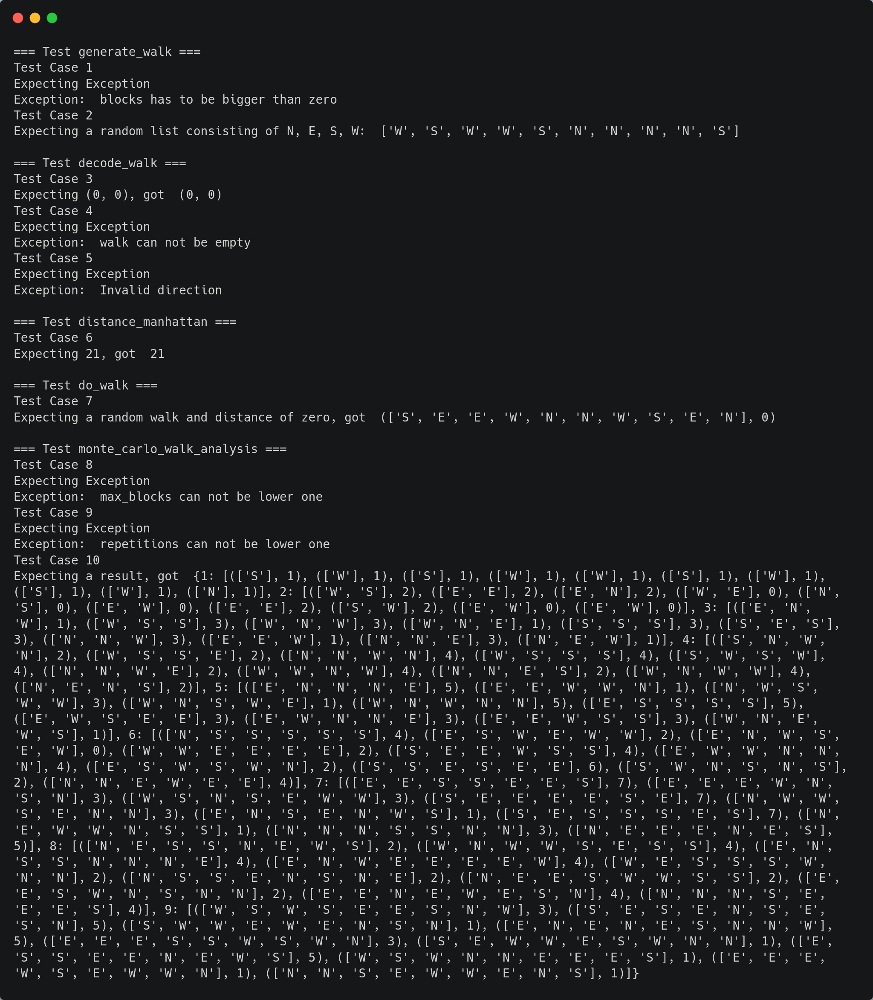

= Übung 01
:author: Florian Weingartshofer
:email: <S1910307103@students.fh-hagenberg.at>
:reproducible:
:experimental:
:listing-caption: Listing
:source-highlighter: rouge
:rouge-style: github
:toc:
:sectnums:
:sectnumlevels: 6
:toclevels: 6
// Variables
:src: ../src/euro-bet-server/src/main/java/swe4
:fxml: ../src/euro-bet-server/src/main/resources/swe4/client
:img: ./img
:imagesoutdir: ./out

<<<
== Lösungsidee

Die Funktionen werden nach Angabe implementiert.
Die Parameter der Funktionen werden auf die Sinnhaftigkeit der Werte überprüft und ein Fehler wird ausgelöst, sollten die Werte nicht passen.

== Source Code

[source,python]
----
include::./01_Basic_Library..py[lines=1.. 77]
----

<<<
== Test Cases

=== Test Case 1

Der `generate_walk` Funktion wird ein ungültiger Wert übergeben und dadurch sollte eine Exception ausgelöst werden.

[source,python]
----
try:
    print("Expecting Exception")
    generate_walk(blocks=-1).__next__()
except ValueError as e:
    print("Exception: ", e)
----

.Output
[source]
----
Test Case 1
Expecting Exception
Exception:  blocks has to be bigger than zero
----

=== Test Case 2

Dieselbe Funktion wird mit dem gültigen Wert `10` aufgerufen und eine erfolgreiche Durchführung wird erwartet.

[source,python]
----
print("Expecting a random list consisting of N, E, S, W: ", list(generate_walk(10)))
----

.Output
[source]
----
Expecting a random list consisting of N, E, S, W:  ['S', 'E', 'W', 'S', 'E', 'N', 'S', 'E', 'E', 'W']
----

<<<
=== Test Case 3

Es wird `decode_walk` mit einem Beispiel walk aufgerufen, welcher wieder am Startpunkt endet.
Es wird ein Vector `(0, 0)` erwartet.

[source,python]
----
example_walk = ["N", "N", "N", "W", "W", "W", "S", "S", "S", "E", "E", "E"]
print("Expecting (0, 0), got ", decode_walk(example_walk))
----

.Output
[source]
----
Expecting (0, 0), got  (0, 0)
----

=== Test Case 4

Es wird `decode_walk` mit einer leeren Liste aufgerufen und eine Exception erwartet.

[source,python]
----
try:
    print("Expecting Exception")
    decode_walk([])
except ValueError as e:
    print("Exception: ", e)
----

.Output
[source]
Expecting Exception
Exception:  walk can not be empty

<<<
=== Test Case 5

Es wird `decode_walk` mit einem ungültigen Symbol aufgerufen und eine Exception erwartet.

[source,python]
    try:
        print("Expecting Exception")
        decode_walk(["P"])
    except ValueError as e:
        print("Exception: ", e)

.Output
[source]
Expecting Exception
Exception:  Invalid direction

=== Test Case 6

Es wird die `distance_manhattan` mit einem gültigen Start und End Tupel aufgerufen und `21` erwartet.

[source,python]
end_tuple = (7, 7)
print("Expecting 21, got ", distance_manhattan((3, 4), end_tuple))

.Output
[source]
Expecting 21, got  21

<<<
=== Test Case 7

Es wird `do_walk` mit `blocks=10` und einer Distanz-Funktion, welche immer null zurückliefert, aufgerufen.
Es wird ein zufälliger walk mit der Distanz `0` erwartet.

[source,python]
print("Expecting a random walk and distance of zero, got ", do_walk(10, dist=lambda x, y: 0))

.Output
[source]
Expecting a random walk and distance of zero, got  (['W', 'W', 'W', 'S', 'S', 'S', 'N', 'S', 'E', 'E'], 0)

=== Test Case 8

Es wird die `monte_carlo_walk_analysis` Funktion mit einem ungültigen Input für `max_blocks` aufgerufen.

[source,python]
try:
    print("Expecting Exception")
    monte_carlo_walk_analysis(0, 10)
except ValueError as e:
    print("Exception: ", e)

.Output
[source]
Expecting Exception
Exception:  max_blocks can not be lower one

<<<
=== Test Case 9

Es wird die `monte_carlo_walk_analysis` Funktion mit einem ungültigen Input für `repetitions` aufgerufen.

[source,python]
try:
    print("Expecting Exception")
    monte_carlo_walk_analysis(10, -10)
except ValueError as e:
    print("Exception: ", e)

.Output
[source]
Expecting Exception
Exception:  repetitions can not be lower one

=== Test Case 10

Es wird die `monte_carlo_walk_analysis` Funktion mit gültigen Parametern aufgerufen.

[source,python]
print("Expecting a result, got ", monte_carlo_walk_analysis(10, 10))

.Output
[source]
----
Expecting a result, got  {1: [(['S'], 1), (['W'], 1), (['S'], 1), (['W'], 1), (['W'], 1), (['S'], 1), (['W'], 1), (['S'], 1), (['W'], 1), (['N'], 1)], 2: [(['W', 'S'], 2), (['E', 'E'], 2), (['E', 'N'], 2), (['W', 'E'], 0), (['N', 'S'], 0), (['E', 'W'], 0), (['E', 'E'], 2), (['S', 'W'], 2), (['E', 'W'], 0), (['E', 'W'], 0)], 3: [(['E', 'N', 'W'], 1), (['W', 'S', 'S'], 3), (['W', 'N', 'W'], 3), (['W', 'N', 'E'], 1), (['S', 'S', 'S'], 3), (['S', 'E', 'S'], 3), (['N', 'N', 'W'], 3), (['E', 'E', 'W'], 1), (['N', 'N', 'E'], 3), (['N', 'E', 'W'], 1)], 4: [(['S', 'N', 'W', 'N'], 2), (['W', 'S', 'S', 'E'], 2), (['N', 'N', 'W', 'N'], 4), (['W', 'S', 'S', 'S'], 4), (['S', 'W', 'S', 'W'], 4), (['N', 'N', 'W', 'E'], 2), (['W', 'W', 'N', 'W'], 4), (['N', 'N', 'E', 'S'], 2), (['W', 'N', 'W', 'W'], 4), (['N', 'E', 'N', 'S'], 2)], 5: [(['E', 'N', 'N', 'N', 'E'], 5), (['E', 'E', 'W', 'W', 'N'], 1), (['N', 'W', 'S', 'W', 'W'], 3), (['W', 'N', 'S', 'W', 'E'], 1), (['W', 'N', 'W', 'N', 'N'], 5), (['E', 'S', 'S', 'S', 'S'], 5), (['E', 'W', 'S', 'E', 'E'], 3), (['E', 'W', 'N', 'N', 'E'], 3), (['E', 'E', 'W', 'S', 'S'], 3), (['W', 'N', 'E', 'W', 'S'], 1)], 6: [(['N', 'S', 'S', 'S', 'S', 'S'], 4), (['E', 'S', 'W', 'E', 'W', 'W'], 2), (['E', 'N', 'W', 'S', 'E', 'W'], 0), (['W', 'W', 'E', 'E', 'E', 'E'], 2), (['S', 'E', 'E', 'W', 'S', 'S'], 4), (['E', 'W', 'W', 'N', 'N', 'N'], 4), (['E', 'S', 'W', 'S', 'W', 'N'], 2), (['S', 'S', 'E', 'S', 'E', 'E'], 6), (['S', 'W', 'N', 'S', 'N', 'S'], 2), (['N', 'N', 'E', 'W', 'E', 'E'], 4)], 7: [(['E', 'E', 'S', 'S', 'E', 'E', 'S'], 7), (['E', 'E', 'E', 'W', 'N', 'S', 'N'], 3), (['W', 'S', 'N', 'S', 'E', 'W', 'W'], 3), (['S', 'E', 'E', 'E', 'E', 'S', 'E'], 7), (['N', 'W', 'W', 'S', 'E', 'N', 'N'], 3), (['E', 'N', 'S', 'E', 'N', 'W', 'S'], 1), (['S', 'E', 'S', 'S', 'S', 'E', 'S'], 7), (['N', 'E', 'W', 'W', 'N', 'S', 'S'], 1), (['N', 'N', 'N', 'S', 'S', 'N', 'N'], 3), (['N', 'E', 'E', 'E', 'N', 'E', 'S'], 5)], 8: [(['N', 'E', 'S', 'S', 'N', 'E', 'W', 'S'], 2), (['W', 'N', 'W', 'W', 'S', 'E', 'S', 'S'], 4), (['E', 'N', 'S', 'S', 'N', 'N', 'N', 'E'], 4), (['E', 'N', 'W', 'E', 'E', 'E', 'E', 'W'], 4), (['W', 'E', 'S', 'S', 'S', 'W', 'N', 'N'], 2), (['N', 'S', 'S', 'E', 'N', 'S', 'N', 'E'], 2), (['N', 'E', 'E', 'S', 'W', 'W', 'S', 'S'], 2), (['E', 'E', 'S', 'W', 'N', 'S', 'N', 'N'], 2), (['E', 'E', 'N', 'E', 'W', 'E', 'S', 'N'], 4), (['N', 'N', 'N', 'S', 'E', 'E', 'E', 'S'], 4)], 9: [(['W', 'S', 'W', 'S', 'E', 'E', 'S', 'N', 'W'], 3), (['S', 'E', 'S', 'E', 'N', 'S', 'E', 'S', 'N'], 5), (['S', 'W', 'W', 'E', 'W', 'E', 'N', 'S', 'N'], 1), (['E', 'N', 'E', 'N', 'E', 'S', 'N', 'N', 'W'], 5), (['E', 'E', 'E', 'S', 'S', 'W', 'S', 'W', 'N'], 3), (['S', 'E', 'W', 'W', 'E', 'S', 'W', 'N', 'N'], 1), (['E', 'S', 'S', 'E', 'E', 'N', 'E', 'W', 'S'], 5), (['W', 'S', 'W', 'N', 'N', 'E', 'E', 'E', 'S'], 1), (['E', 'E', 'E', 'W', 'S', 'E', 'W', 'W', 'N'], 1), (['N', 'N', 'S', 'E', 'W', 'W', 'E', 'N', 'S'], 1)]}

----

<<<
=== Screenshot des Outputs
