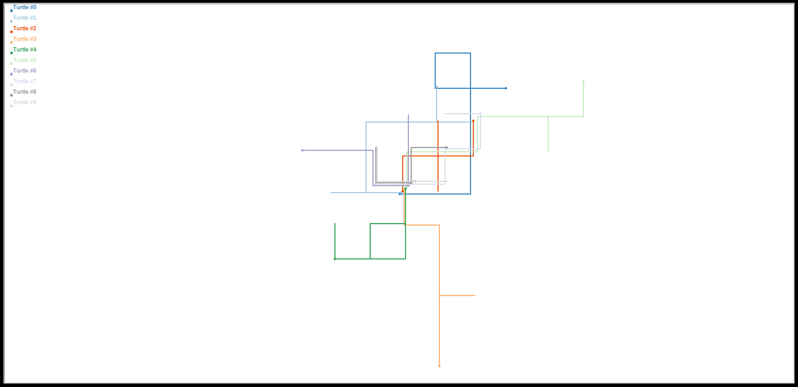
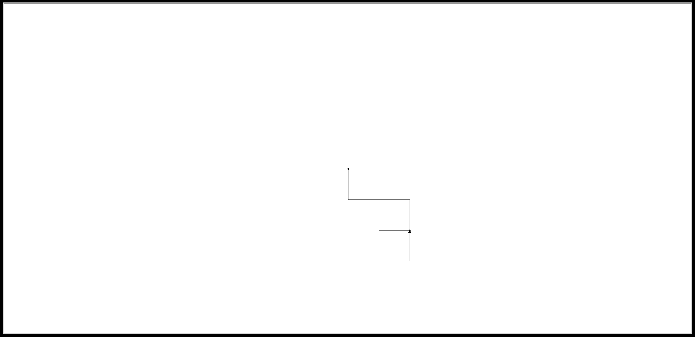

= 02 - Walk Visualization
:author: Florian Weingartshofer
:email: <S1910307103@students.fh-hagenberg.at>
:reproducible:
:experimental:
:listing-caption: Listing
:source-highlighter: rouge
:rouge-style: github
:toc:
:sectnums:
:sectnumlevels: 6
:toclevels: 6
// Variables
:img: ./img
:imagesoutdir: ./out

== Lösungsidee

Die Visualisierung wird laut Angabe implementiert, zusätzlich, wird auch noch eine Legende erstellt.
Es wird die Übung 01 als Python Modul eingebunden, um die Applikation testen zu können und Code Duplizierung zu vermeiden.

== Code
[source,python]
----
include::./e02.py[]
----

== Test Cases
=== Vollständiger Durchlauf
Ein vollständiger Durchlauf mit 10 Walks zu 10 Blöcken.

=== Einfacher Durchlauf
Visualisierung von einem Walk.

