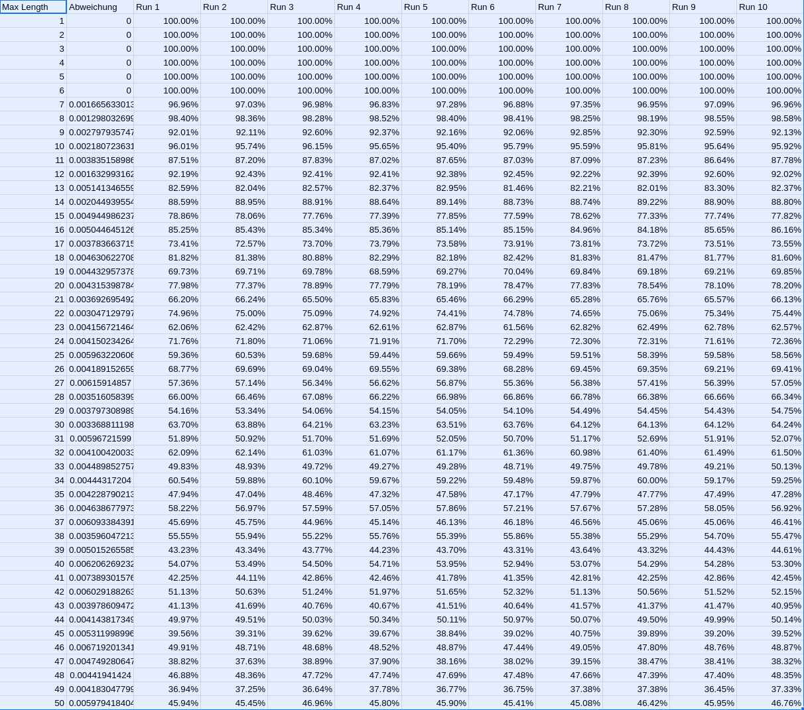

= Übung 04
:author: Florian Weingartshofer
:email: <S1910307103@students.fh-hagenberg.at>
:reproducible:
:experimental:
:listing-caption: Listing
:source-highlighter: rouge
:rouge-style: github
:toc:
:sectnums:
:sectnumlevels: 6
:toclevels: 6
// Variables
:img: ./img
:imagesoutdir: ./out

<<<
== Lösungsidee
Die Bedingung, dass ein Walk zu kurz ist sei `n`.

Es wird zum Generieren der Walks die `monte_carlo_walk` Funktion aus Übung 04 genutzt.
Dadurch wird der Walk selber nicht gespeichert, da dieser nicht gebraucht wird.
Für die Analyse wird nur die Distanz aller generierten Walks gebraucht.
Dann wird berechnet wie viele Walks einer bestimmten maximal Distanz größer als `n` sind,
daraus wird die Wahrscheinlichkeit errechnet, ob ein Walk mit einer bestimmten max. Distanz zu kurz ist.

== Fragen
=== How do you determine that your results are stable with respect to the number of repetitions that are performed for each maximum length?
Jede maximal Distanz wird sehr oft ausgeführt, bedeutet, dass zum Beispiel für die max. Distanz 20 die Walk-Generierung 10.000-mal ausgeführt wird.
Dadurch kann gewährleistet werden, dass die Ergebnisse stabil sind und nicht schwanken.
Zusätzlich wird das ganze nochmal 10-mal ausgeführt. Die Standardabweichung ist bei denm jeweiligen `n` relativ gering.

.Standard Deviation of 10 Runs

=== What happens if you change the condition for a walk being short from having a distance of smaller or equal six to other numbers?
Alle Walks, deren maximal Distanz kleiner gleich `n` sind, sind natürlich zu kurz.
Weiters werden die Wahrscheinlichkeiten nach vorne oder hinten verschoben.
Zum Beispiel, wenn `n` von 6 auf 7 erhöht wird, werden die Wahrscheinlichkeiten um eins verschoben.

=== Can you identify a pattern for even and odd numbers?
Wenn `n` eine gerade Zahl ist,
sind die Walks mit einer geraden max. Distanz mit einer höheren Wahrscheinlichkeit zu kurz als die Walks mit einer ungeraden max. Distanz.
Dass gleiche gilt umgekehrt, falls `n` ungerade ist, die Walks mit einer ungeraden max. Distanz sind durchschnittlich öfters zu kurz als jene mit einer geraden max. Distanz.

== Code
[source,python]
----
include::Final.py[]
----

== Output
[source]
----
Running monte carlo walk with params: max_distance=50, iterations=10000, walk_length_condition=6
Walks of length  1 are with a probability of 100.00% short.
Walks of length  2 are with a probability of 100.00% short.
Walks of length  3 are with a probability of 100.00% short.
Walks of length  4 are with a probability of 100.00% short.
Walks of length  5 are with a probability of 100.00% short.
Walks of length  6 are with a probability of 100.00% short.
Walks of length  7 are with a probability of  97.01% short.
Walks of length  8 are with a probability of  98.54% short.
Walks of length  9 are with a probability of  92.64% short.
Walks of length 10 are with a probability of  95.41% short.
Walks of length 11 are with a probability of  87.88% short.
Walks of length 12 are with a probability of  91.79% short.
Walks of length 13 are with a probability of  82.07% short.
Walks of length 14 are with a probability of  88.69% short.
Walks of length 15 are with a probability of  77.43% short.
Walks of length 16 are with a probability of  85.19% short.
Walks of length 17 are with a probability of  73.52% short.
Walks of length 18 are with a probability of  81.10% short.
Walks of length 19 are with a probability of  69.27% short.
Walks of length 20 are with a probability of  77.68% short.
Walks of length 21 are with a probability of  66.28% short.
Walks of length 22 are with a probability of  75.34% short.
Walks of length 23 are with a probability of  62.85% short.
Walks of length 24 are with a probability of  71.92% short.
Walks of length 25 are with a probability of  58.87% short.
Walks of length 26 are with a probability of  69.09% short.
Walks of length 27 are with a probability of  56.51% short.
Walks of length 28 are with a probability of  66.11% short.
Walks of length 29 are with a probability of  53.85% short.
Walks of length 30 are with a probability of  63.48% short.
Walks of length 31 are with a probability of  50.92% short.
Walks of length 32 are with a probability of  62.03% short.
Walks of length 33 are with a probability of  49.76% short.
Walks of length 34 are with a probability of  59.56% short.
Walks of length 35 are with a probability of  47.15% short.
Walks of length 36 are with a probability of  57.37% short.
Walks of length 37 are with a probability of  46.13% short.
Walks of length 38 are with a probability of  55.27% short.
Walks of length 39 are with a probability of  43.83% short.
Walks of length 40 are with a probability of  54.20% short.
Walks of length 41 are with a probability of  42.70% short.
Walks of length 42 are with a probability of  52.23% short.
Walks of length 43 are with a probability of  41.24% short.
Walks of length 44 are with a probability of  50.13% short.
Walks of length 45 are with a probability of  39.65% short.
Walks of length 46 are with a probability of  49.14% short.
Walks of length 47 are with a probability of  37.74% short.
Walks of length 48 are with a probability of  46.69% short.
Walks of length 49 are with a probability of  37.17% short.
Walks of length 50 are with a probability of  45.81% short.
----