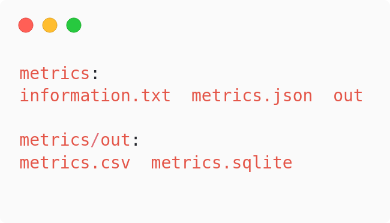
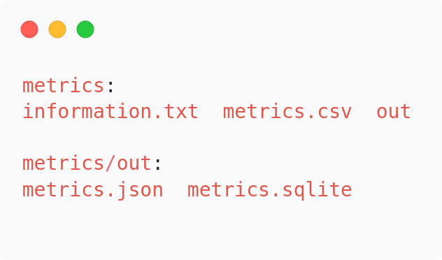
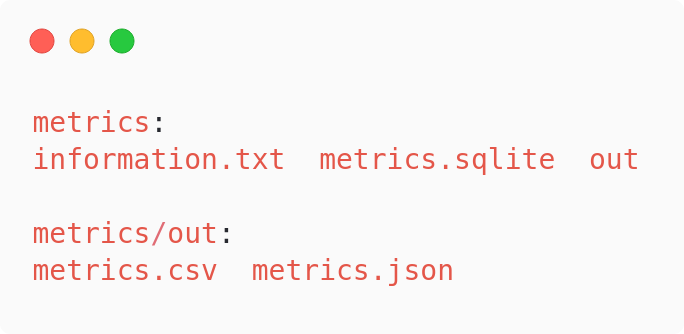

= Exercise 06
Florian Weingartshofer <S1910307103@fhooe.at>
1.0, Jannuary 30, 2022: Exercise 06
:reproducible:
:experimental:
:listing-caption: Listing
:source-highlighter: rouge
:rouge-style: github
:toc:
:sectnums:
:sectnumlevels: 6
:toclevels: 6
// Variables
:img: ./img
:imagesoutdir: ./out

<<<
== Dependencies
Zum Formattieren wurde https://github.com/psf/black[black] verwendet.

.requirements.txt
[source,text]
----
include::../requirements.txt[]
----

== Annahmen
* JSON-Files sind nicht zu stark genested und von pandas lesbar
* Optimaler weise können die JSON-Files einfach in Tabellen-Format dargestellt werden, das bedeutet, dass das Root-Element ein Array ist und die Objekte darin alle dasselbe Schema haben
* Die anzulegende Ordnerstruktur existiert davor noch nicht und das Script hat Lese- und Schreibrechte
* .csv und .txt sind dasselbe Format
* .sqlite und .db sind dasselbe Format

== Implementierung
Das Skript wurde laut Angabe implementiert.
Es wird überprüft, ob die korrekten Argumente mitgegeben wurde,
sollte dies nicht der Fall sein, wird der Nutzer zu einer erneuten Eingabe aufgefordert.
Dann wird überprüft, ob das File existiert und die korrekte file-extension hat.
Danach wird das File ausgelesen, hier kann der Nutzer wieder nach Zusatzinformationen gefragt werden, wie table name oder csv seperator.
Das File wird dann geparsed, hier kann es zu Fehlern kommen, wenn das File nicht valide ist, also kein valides JSON; CSV oder Sqlite Format.
Zuletzt wird die geforderte Ornderstruktur erstellt und das Input-File konvertiert in alle anderen Formate und ein Metainformations-File erstellt.

<<<
== Test Cases
Für die Test-Cases wurde ein Json, CSV und Sqlite File mit jeweils 1000 Einträgen genutzt. Wobei bei manchen Spalten Null-Werte vorkommen können.

.Ausschnitt metrics.json
[source,json]
----
include::../metrics.json[lines=2..11]
----

.Ausschnitt metrics.csv
[source,csv]
----
include::../metrics.csv[lines=1..10]
----

<<<
=== Test Case: None-Existent File
Es wird als input ein nicht existierendes File angegeben.

.Output
[source]
----
Please specify the file you want to convert: logs.json
logs.json either does not exist or is not a file

Process finished with exit code 1
----

=== Test Case: Wrong File Extension
Es wird als input ein File mit der falschen File Extension angegeben.

.Output
[source]
----
Please specify the file you want to convert: ./main.py
main.py cannot be converted

Process finished with exit code 1
----

=== Test Case: Empty Input
Es wird ein leerer Input angegeben.

.Output
[source]
----
Please specify the file you want to convert:
Input cant be empty

Process finished with exit code 1
----

<<<
=== Test Case: Valides JSON
Es wird metrics.json angegeben, dieses enthält valides Json.

.Output
[source]
----
Please specify the file you want to convert: metrics.json

Process finished with exit code 0
----

.File Output

=== Test Case: Valides CSV
Es wird metrics.csv angegeben, dieses enthält valides Csv.

.Output
[source]
----
Please specify the file you want to convert: ./metrics.csv
Please input the csv seperator: ,

Process finished with exit code 0
----

.File Output

=== Test Case: Valide Sqlite Database
Es wird metrics.sqlite angegeben, dieses enthält eine valide Sqlite Datenbank.

.Output
[source]
----
Please specify the file you want to convert: ./metrics.sqlite
Please input the table: metrics

Process finished with exit code 0
----

.File Output

Und noch ein Auszug aus den Meta-Informationen:

.information.txt
[source]
----
Input Type: .sqlite
Output Types: .json, .csv
Columns: index, type, value, start, end, name, createdAt, instanceId, id
Rows: 1000
----
