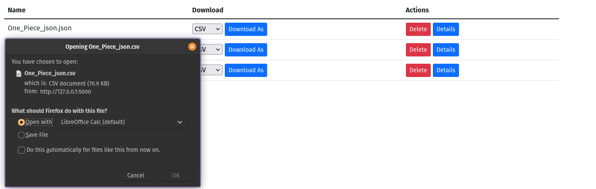

= Exercise 07
:author: Florian Weingartshofer <S1910307103@fhooe.at>
:reproducible:
:experimental:
:listing-caption: Listing
:source-highlighter: rouge
:rouge-style: github
:toc:
:sectnums:
:sectnumlevels: 6
:toclevels: 6
// Variables
:img: ./img
:imagesoutdir: ./out

<<<
== Dependencies

- `black`: Formatter für Python
- `pandas`: Wird zum Konvertieren und bearbeiten von den Datasets benötigt
- `flask`: Library für Http Webserver, hat auch Peer-Dependencies wie Click oder Jinja2

.requirements.txt
----
include::../requirements.txt[]
----

== Lösungsidee
Die Library von Exercise 06 wird an diese Übung angepasst, damit in bestimmte File Formate konvertiert werden kann.
Die Datasets werden in einem Upload-Folder gespeichert und die Filenamen werden auf nicht erlaubte Zeichen geprüft.
Falls Files konvertiert werden müssen, werden diese im temp Verzeichnis des OSs abgelegt, da diese nur für kurze Zeit gebraucht werden. Dafür wird beim Server start ein Directory angelegt.

== Annahmen
- Die Files sind in UTF-8 kodiert.

== Test-Cases
=== Upload von einem Dataset
Es wird ein neue JSOn Dataset hochgeladen.

.Upload Form

Das File wird erfolgreich hochgeladen und der Filename wird sanitized(`One Piece json.json` -> `One_Piece_json.json`)

.Uploaded Dataset

=== Details anzeigen
Es werden alle Details angezeigt.

.Details von `One_Piece_json.json`

=== Zelle Editieren
Es wird eine einzelne Zelle editiert.

.Zelle Name in Zeile 0 wird editiert

.Updated Details

=== Zeile löschen
Es wird eine Zeile gelöscht.

.Original

.Zeile wurde gelöscht

=== Spalte löschen
Es wird die Spalte `Unnamed: 0` gelöscht.

.Original

.Spalte wurde gelöscht

=== File in andere Formate konvertieren
Format auswählen und downloaden.

.Download

.csv file
[source,csv]
----
include::testfiles/One_Piece_json.csv[lines=1..10]
----

.sqlite database

=== File löschen
Das File wird vom Server entfernt.

