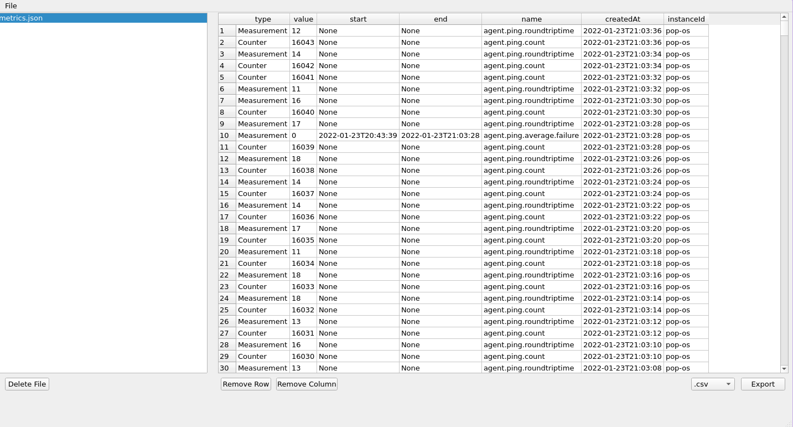
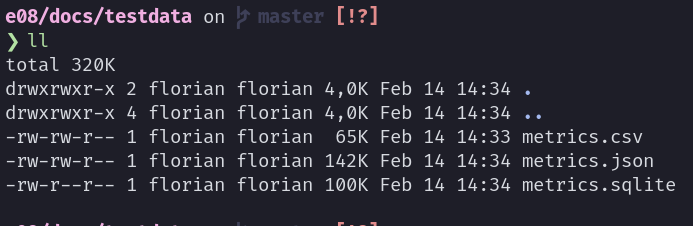

= Exercise 08
:author: Florian Weingartshofer
:email: <S1910307103@fhooe.at>
:reproducible:
:experimental:
:listing-caption: Listing
:source-highlighter: rouge
:rouge-style: github
:toc:
:sectnums:
:sectnumlevels: 6
:toclevels: 6
// Variables
:img: ./img
:imagesoutdir: ./out

<<<
== Lösungsidee
Die Anwendung basiert grundsätzlich auf einer Master-Details-View, damit können Dialoge vermieden werden und man sieht alle Informationen gleich auf einem Blick.
Es können viele Funktionalitäten aus der letzten Übung wieder verwendet werden.

.Simple Layout of the Application
[ditaa]
....
+--------------------------------------------------------------------------+
| Menubar                                                                  |
| +-------------------+ +------------------------------------------------+ |
| |    Master View    | |                  Detail View                   | |
| |                   | |                                                | |
| |                   | |                                                | |
| |                   | |                                                | |
| |                   | |                                                | |
| |                   | |                                                | |
| |                   | |                                                | |
| |                   | |                                                | |
| |                   | |                                                | |
| +-------------------+ +------------------------------------------------+ |
| +----------------------------------------------------------------------+ |
| | Actions                                                              | |
| +----------------------------------------------------------------------+ |
+--------------------------------------------------------------------------+
....

== Dependencies
Als Dependencies wurden nur pandas und PyQt5 genutzt.
Zum Formattieren noch zusätzlich black.

.requirements
[source]
----
include::../requirements.txt[]
----

<<<
== Test Cases
=== Dataset hinzufügen
Es wird ein Dataset hinzugefügt.
Der Button zum hinzufügen eines Datasets ist in der Menubar, allerdings wird der nicht angezeigt bei Screenshots, da hierfür das Fenster im Fokus sein muss.

.File Dialog

Das File wird erfolgreich hinzugefügt.

.Added File

<<<
=== Duplikat hinzufügen
Es wird dasselbe File ein zweites Mal hinzugefügt.

Dadurch wird eine Fehler Dialog angezeigt.

.Duplicate Error

<<<
=== Detail-View anzeigen
Um die Detail-View eines Dataset anzeigen zu können, muss der Eintrag im Master-View markiert werden.

.Detail View

<<<
=== Zelle Editieren
Um eine einzelne Zelle editieren zu können muss diese doppelgeklickt werden, dass ist das normale Verhalten von dem TableWidget.
Die Änderungen werden gleich persistiert, allerding sist es schwierig persistenz über Screenshots zu zeigen.

.Before Cell Edit

.After Cell Edit

<<<
=== Zeile löschen
Um eine einzelne Zeile zu löschen, muss nur eine Zelle in dieser markiert sein.

.Before Row Removal

.After Row Removal
image::img/after-row-removal.png[]

<<<
=== Spalte löschen
Funktioniert ähnlich zum Zeilen löschen, Spalte oder Zelle in der Spalte markieren und auf den Button klicken.

.Before Column Removal
image::img/after-row-removal.png[]

.After Column Removal

<<<
=== Export
Der Export funktioniert mit einem Dropdown-Menü, in welchem das gewünschte Format angegeben wird.
Danach muss der Zielordner angegeben werden.

.Export Dialog

.Minimalistic Success Dialog

.Contents of Destination

Dies geht natürlich mit allen Filetypen.

.All exported Files

<<<
=== Import von anderen Filetypen
Die vorhin erstellten Files werden wieder importiert.

.All imported Files

<<<
=== Dataset löschen
Zuletzt werden die Datasets wieder gelöscht.

.Before Removal of Datasets

.After Removal of Datasets

