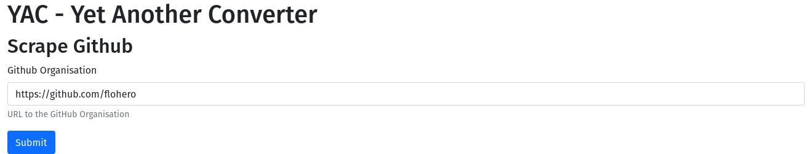
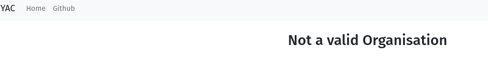
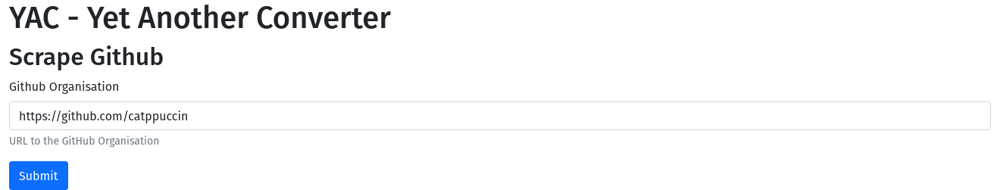
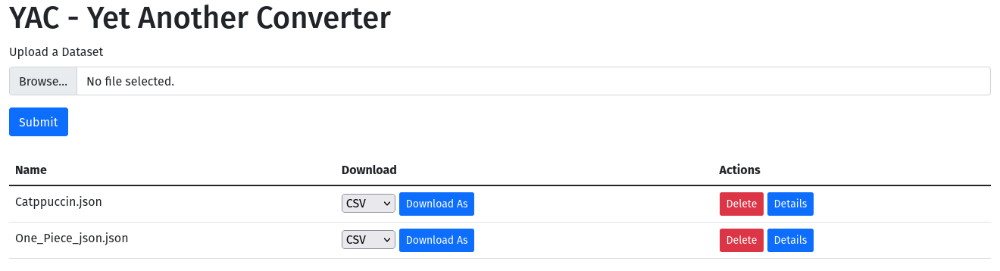
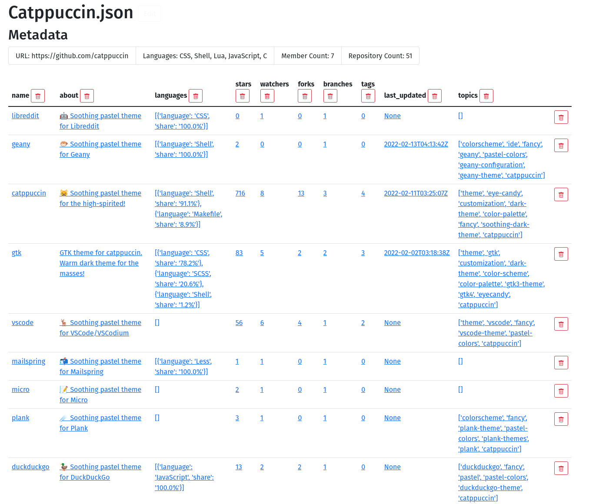

= Exercise 09
:author: Florian Weingartshofer <S1910307103@fhooe.at>
:reproducible:
:experimental:
:listing-caption: Listing
:source-highlighter: rouge
:rouge-style: github
:toc:
:sectnums:
:sectnumlevels: 6
:toclevels: 6
// Variables
:img: ./img
:imagesoutdir: ./out

== Dependencies
Es wurden keine neuen Dependencies hinzugefügt bis auf black zum Formattieren.

.requirements.txt
[source]
----
include::../requirements.txt[]
----

== Lösungsidee
Es wird wie in der Übung Webscraping durchgeführt.
Als Erstes wird überprüft, ob die angegebene URl eine GitHub Organisation ist.
Dann werden die Daten von der Seite und Subseiten geladen und in ein Dictionary geladen.

Damit beim Sichern der Daten die Metadaten nicht verloren gehen, werden diese zusätzlich in einer Sqlite-Datenbank abgelegt.
Die Metadaten werden dann bei Anzeige der Details-Seite mitgeladen.

Zur Website selber wurde nur eine Seite mit Form zum Starten des Web-scrapings angelegt.

== Test-Cases
=== GitHub Profile
Es wird ein GitHub Profil angegeben und keine Organisation.

.GitHub Profile

.Error

=== Scrape Gh-Organisation
Es wird folgende Organisation angegeben: https://github.com/catppuccin[]

.Github Organisation

.Ergebnis

=== Details von Organisation
Die Details zu GitHub Organisaton.

.Details Gh-Org

